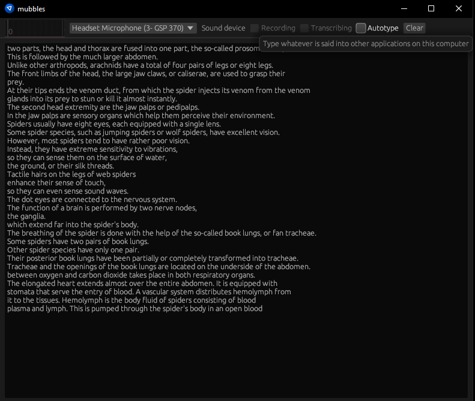

# Mubbles

An Egui wrapper around Whisper.cpp, the OpenAI speech-to-text model.

Can record from microphone and speakers.

## Usage

Obtain a ggml-format Whisper model. You can get a pytorch formatted model from [huggingface](https://huggingface.co/openai/whisper-base) and then convert it to ggml using [this script](https://github.com/ggerganov/whisper.cpp/blob/master/models/convert-pt-to-ggml.py).

Once you have a model file, run the app:

```sh
cargo run
```

You may need to remove the `cuda` feature from the `whisper-rs` dependency if you don't have a CUDA-capable GPU (and the cuda tookit installed). In this case, I would recommend using the Tiny model.

## Screenshot

 

