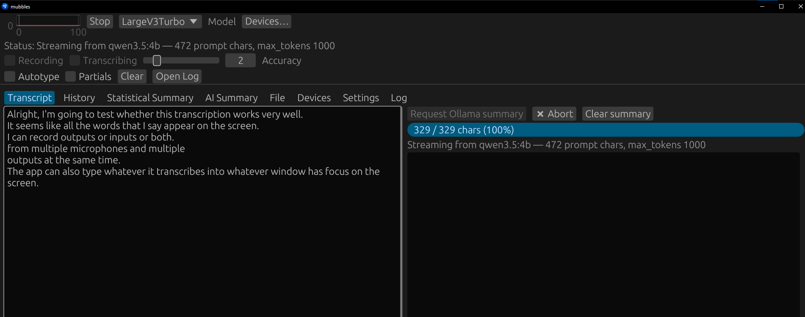

# Mubbles

An Egui wrapper around HuggingFace's Candle Whisper model, which implements Whisper, the OpenAI speech-to-text model.

Can record from microphone and speakers.

## Usage

Run the app.

Cuda builds require Nvidia / Cuda drivers.

Huggingface models will be downloaded automatically when transcription starts.

Some things are still a bit broken because I don't use them (this is really a personal project).

PRs welcome but I may not get to them for a few weeks.

## Regular usage

Install the app into the default cargo bin directory (probably `~/.cargo/bin`):

    cargo install --path . --features cuda

Depending on the accelerator you have available, choose which feature -- `mkl` for intel CPUs or `cuda` for Nvidia cards with CudaNN installed in the system.

## Screenshot

 

## Build on ubuntu

```sh
apt install build-essential libssl-dev pkg-config libasound2-dev
```

Also, if you don't have cuda but do have an intel cpu, use --features mkl. 

https://www.intel.com/content/www/us/en/developer/tools/oneapi/onemkl-download.html?operatingsystem=linux&linux-install=apt

## Features

- Real-time transcription from microphone or speaker loopback
- Echo cancellation (optional): mute mic while speaker output is active
- Per-device configurable trigger level and audio level monitoring (logarithmic dB scale)
- Switch audio devices without stopping transcription
- File transcription (wav, mp3, flac, ogg, m4a, aac, wma) with silence-based splitting
- AI summarization via Ollama, OpenAI, or any OpenAI-compatible API
  - Streaming output, incremental chunking, configurable prompts
  - Auto-detects local Ollama models and context length
- Statistical summary (most unusual words per section)
- Autotype: types transcript into the foreground application
- Word-level timestamps and alignment
- Model selection (tiny, base, small, medium, large, distil variants)
- CUDA and Intel MKL acceleration
- Transcription history with per-word accuracy
- Monthly log files

## Roadmap

1. UI is a bit crowded, simplify
2. fix partials to show the mel spectrogram in real time
   - last attempt at this failed, wrangling texture memory is a little complex in egui
3. implement snippet saving, where you can click on a fragment and hear it / save the audio file.
4. figure out why the accuracy for the first and last word is so bad
5. implement a better speech detection / segmenting algorithm. 
    - I've had a go with silero and:
    - couldn't get the model to download automatically / easily and
    - I don't like onnx because it's not super transparent and
    - adds a whole lot of dependencies. 

